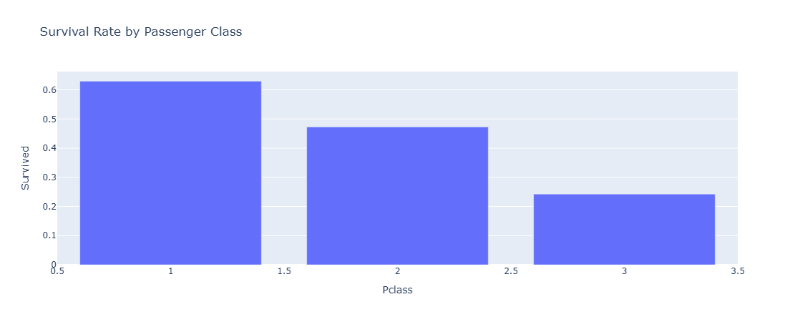
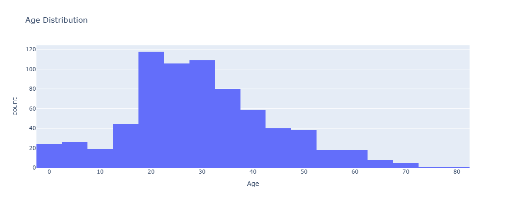
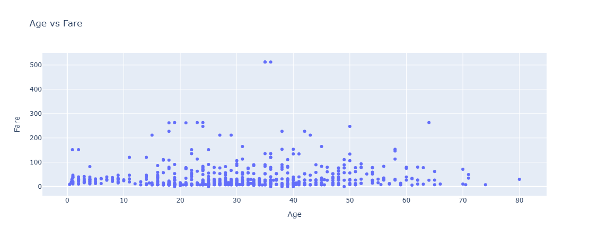

# Titanic EDA Dashboard

## 📌 Overview
This project presents an interactive Exploratory Data Analysis (EDA) dashboard for the Titanic dataset using Python, Pandas, Plotly, and Dash. It demonstrates the complete EDA workflow, including data preprocessing, visualization, pattern analysis, and an interactive dashboard for exploring the dataset.

---

## 🚀 Features
- Data Cleaning and Preprocessing
- Handling Missing Values
- Data Aggregation and Filtering
- Exploratory Data Analysis (EDA)
- Interactive Visualizations using Plotly
- Dashboard Development using Dash
- Summary Report Generation

---

## 📊 Visualizations
The dashboard includes:

- Survival Rate by Passenger Class
- Age Distribution of Passengers
- Age vs Fare Scatter Plot
- Correlation Heatmap

---

## 🛠️ Technologies Used
- Python
- Pandas
- Plotly
- Dash
- Matplotlib
- Seaborn
- Jupyter Notebook

---

## 📂 Project Structure

```
Titanic-EDA-Dashboard/
│── app.py
│── titanic.csv
│── requirements.txt
│── EDA project.ipynb
│── Titanic Dataset EDA Report.txt
│── README.md
│── images
     │── dashboard1.png
     │── dashboard2.png
     │── dashboard3.png
```

---

## ▶️ Running the Dashboard Locally

1. Clone the repository:

```bash
git clone https://github.com/chandana-py/Titanic-EDA-Dashboard.git
```

2. Navigate to the project folder:

```bash
cd Titanic-EDA-Dashboard
```

3. Install the required packages:

```bash
pip install -r requirements.txt
```

4. Run the application:

```bash
python app.py
```

5. Open your browser and visit:

```
http://127.0.0.1:8050
```

---

## 📈 Key Insights

- First-class passengers had the highest survival rate.
- Most passengers were between 20 and 40 years of age.
- Ticket fares contain a few high-value outliers.
- The dashboard provides an interactive way to explore passenger demographics and survival patterns.

---

## 📚 Dataset

- Titanic Dataset (CSV)

---

## Dashboard Preview

<p align="center">
  
  
  
</p>

---

## 👩‍💻 Author

**Chandana B**

Computer Science Engineering | AI & Machine Learning Enthusiast

